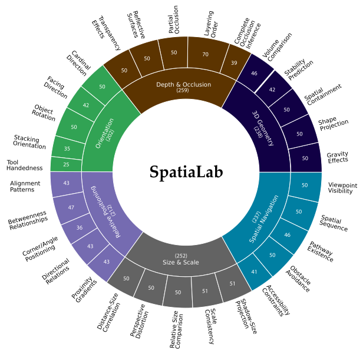

# SpatiaLab: Can Vision–Language Models Perform Spatial Reasoning in the Wild?


<div align=center>

[](https://openreview.net/forum?id=fWWUPOb0CT)
[](https://spatialab-reasoning.github.io/)
[](http://arxiv.org/abs/2602.03916) 
[](#)
[](https://github.com/SpatiaLab-Reasoning/SpatiaLab)
[](https://huggingface.co/datasets/ciol-research/SpatiaLab)
[](https://huggingface.co/papers/2602.03916)


***Azmine Toushik Wasi, Wahid Faisal, Abdur Rahman, Mahfuz Ahmed Anik, Munem Shahriar, Mohsin Mahmud Topu, Sadia Tasnim Meem, Rahatun Nesa Priti, Sabrina Afroz Mitu, Md. Iqramul Hoque, Shahriyar Zaman Ridoy, Mohammed Eunus Ali, Majd Hawasly, Mohammad Raza, Md Rizwan Parvez***

Computational Intelligence and Operations Laboratory (CIOL) • Shahjalal University of Science and Technology (SUST) • Monash University • Qatar Computing Research Institute (QCRI)

*The Fourteenth International Conference on Learning Representations (**ICLR 2026**)*

</div>

---


**SpatiaLab** is a benchmark for evaluating **spatial reasoning** in vision–language models (VLMs) under **real-world, in-the-wild** visual conditions.  
It includes **1,400 visual question–answer pairs** across **6 core spatial categories** and **30 subcategories**, supporting both **multiple-choice (MCQ)** and **open-ended** evaluation formats.  
SpatiaLab exposes substantial gaps between state-of-the-art VLMs and human performance.

<p align="center">
  
</p>

---


## Overview

**Spatial reasoning** is fundamental to human intelligence and real-world embodied AI.  
SpatiaLab provides a comprehensive evaluation suite (1,400 QA pairs) across six core spatial categories:

- Relative Positioning
- Depth & Occlusion
- Orientation
- Size & Scale
- Spatial Navigation
- 3D Geometry

It is designed to test VLMs in **realistic, unconstrained scenes** and highlights large performance gaps between models and humans.

---

## Benchmark Structure and Categorization

SpatiaLab comprises **1,400** validated QA items organized into **6 main categories** and **30 subcategories** (**5** subcategories each).

| Category | Example sub-tasks (5 each) |
|---|---|
| **Relative Positioning** | Left/Right, Above/Below, Between, Adjacency, Corner/Angle |
| **Depth & Occlusion** | Partial occlusion, Complete occlusion, Layer order, Reflection/visibility, Hidden feature |
| **Orientation** | Rotation angle, Facing, Tilt, Tool handedness, Mirror |
| **Size & Scale** | Relative size, Scale ratio, Big/Small, Proportion, Size consistency |
| **Spatial Navigation** | Path existence, Obstacle avoidance, Turn sequence, Viewpoint visibility, Accessibility |
| **3D Geometry** | 3D containment, Intersection, Volume ordering, Pose matching, Stability |

<p align="center">
  
</p>

---

## Data Collection and Annotation

SpatiaLab images and QA pairs were created through:
- **Web crawling**
- **Targeted retrieval**
- **Manual snapshots**

A **3-stage annotation and verification** process yields the final **1,400 QA items**.

<p align="center">
  
</p>

---

## Task Formats & Sample Instances

Every subcategory includes both:
- **Multiple-choice (MCQ)** items (discriminative accuracy)
- **Open-ended** items (generative spatial reasoning)

<p align="center">
  
</p>

### Annotation & QC
Annotators were trained; items passed a 3-stage review to produce gold-standard annotations.  
Inter-annotator reliability and judge agreement are reported in the paper (appendix).

---

## Results

> Tables below are transcribed from the paper.

### Multiple Choice Evaluation Accuracy (%) on SpatiaLab-MCQ

| Model | 3D Geom. (#238) | Dep. & Occu. (#259) | Orientation (#202) | Relat. Posit. (#212) | Size & Scale (#252) | Spati. Navig. (#237) | Overall (#1400) |
|---|---:|---:|---:|---:|---:|---:|---:|
| Random Choice | 25.00 | 25.00 | 25.00 | 25.00 | 25.00 | 25.00 | 25.00 |
| GPT-4o-mini | 47.06 | 39.00 | 47.03 | 47.17 | 49.60 | 49.79 | 46.50 |
| GPT-5-mini | 48.74 | 54.83 | 60.40 | 62.74 | 44.84 | 56.54 | 54.29 |
| Gemini-2.0-Flash | 47.06 | 55.21 | 53.96 | 58.02 | 54.37 | 46.84 | 52.50 |
| Gemini-2.5-Flash | 44.96 | 48.26 | 48.02 | 56.13 | 42.46 | 51.05 | 48.29 |
| Claude 3.5 Haiku | 42.44 | 42.08 | 46.53 | 46.23 | 35.71 | 45.99 | 42.93 |
| Mistral Medium 3.1 | 46.64 | 49.81 | 47.52 | 61.79 | 41.67 | 41.77 | 47.93 |
| InternVL3.5-1B | 33.61 | 32.43 | 23.27 | 37.26 | 31.75 | 30.80 | 31.64 |
| InternVL3.5-2B | 34.03 | 31.66 | 31.68 | 40.57 | 32.54 | 32.49 | 33.71 |
| Qwen-VL2.5-3B-Instruct | 41.18 | 35.52 | 46.04 | 40.09 | 47.22 | 39.24 | 41.43 |
| InternVL3.5-4B | 42.86 | 42.86 | 42.08 | 54.72 | 36.51 | 42.19 | 43.29 |
| Gemma-3-4B-it | 43.70 | 34.36 | 46.53 | 45.75 | 37.30 | 37.97 | 40.57 |
| Qwen-VL2.5-7B-Instruct | 42.86 | 37.84 | 42.57 | 46.23 | 42.06 | 35.44 | 41.00 |
| Llama-3.2-11B-Vision-Instruct | 26.47 | 30.50 | 20.30 | 42.92 | 30.56 | 32.07 | 30.50 |
| Gemma-3-27B-it | 43.28 | 40.15 | 48.02 | 54.25 | 48.02 | 47.26 | 46.57 |
| Qwen-VL2.5-32B-Instruct | 41.18 | 40.15 | 46.53 | 45.28 | 45.24 | 41.77 | 43.21 |
| **InternVL3.5-72B** | 50.00 | 57.14 | 53.47 | 66.04 | 49.21 | 54.85 | **54.93** |
| Qwen-VL2.5-72B-Instruct | 47.06 | 48.65 | 51.98 | 54.25 | 43.65 | 48.95 | 48.86 |
| Llama-3.2-90B-Vision-Instruct | 46.22 | 52.12 | 50.50 | 58.96 | 46.83 | 48.52 | 50.36 |
| o4-mini-medium | 51.26 | 58.30 | 54.95 | 64.15 | 40.87 | 51.48 | 53.21 |
| Gemini-2-Flash-Thinking | 37.82 | 41.31 | 41.58 | 45.75 | 50.40 | 43.04 | 43.36 |
| Gemini-2.5-Flash-Thinking | 45.80 | 53.67 | 52.97 | 56.60 | 55.16 | 53.59 | 52.93 |
| SpaceOm | 42.44 | 38.61 | 48.02 | 37.74 | 42.86 | 39.24 | 41.36 |
| SpaceThinker-Qwen2.5VL-3B | 40.34 | 37.84 | 47.03 | 38.21 | 43.25 | 37.97 | 40.64 |
| SpaceQwen2.5-VL-3B-Instruct | 31.51 | 35.14 | 37.62 | 37.74 | 50.79 | 47.26 | 40.14 |
| **Human Baseline** | 93.70 | 74.13 | 91.58 | 91.51 | 88.89 | 87.76 | **87.57** |

---

### Open-ended Evaluation Accuracy (%) on SpatiaLab-OPEN

| Model | 3D Geom. (#238) | Dep. & Occu. (#259) | Orientation (#202) | Relat. Posit. (#212) | Size & Scale (#252) | Spati. Navig. (#237) | Overall (#1400) |
|---|---:|---:|---:|---:|---:|---:|---:|
| GPT-4o-mini | 23.53 | 16.60 | 23.27 | 30.66 | 17.86 | 21.94 | 26.00 |
| **GPT-5-mini** | 45.38 | 34.75 | 37.13 | 49.53 | 42.46 | 37.13 | **40.93** |
| Gemini-2.0-Flash | 31.93 | 24.32 | 27.23 | 31.13 | 26.19 | 24.47 | 27.43 |
| Gemini-2.5-Flash | 34.03 | 26.64 | 31.68 | 38.68 | 26.59 | 29.54 | 30.93 |
| Claude 3.5 Haiku | 26.05 | 18.92 | 24.75 | 25.94 | 20.24 | 21.10 | 22.64 |
| Mistral Medium 3.1 | 25.21 | 19.31 | 21.78 | 29.25 | 15.08 | 16.88 | 21.00 |
| InternVL3.5-1B | 05.88 | 09.65 | 09.90 | 13.68 | 09.13 | 10.13 | 09.64 |
| InternVL3.5-2B | 12.18 | 11.20 | 10.89 | 23.58 | 11.90 | 18.14 | 14.50 |
| Qwen-VL2.5-3B-Instruct | 15.55 | 08.49 | 15.35 | 10.85 | 18.25 | 09.28 | 12.93 |
| InternVL3.5-4B | 19.33 | 17.76 | 15.84 | 19.81 | 16.27 | 18.99 | 18.00 |
| Gemma-3-4B-it | 20.17 | 13.13 | 14.85 | 23.58 | 15.08 | 19.83 | 17.64 |
| Qwen-VL2.5-7B-Instruct | 15.13 | 15.83 | 20.30 | 27.83 | 15.87 | 19.83 | 18.86 |
| Llama-3.2-11B-Vision-Instruct | 16.81 | 16.99 | 22.28 | 25.00 | 13.49 | 18.57 | 18.57 |
| Gemma-3-27B-it | 22.69 | 16.22 | 24.75 | 34.43 | 22.62 | 21.94 | 23.43 |
| InternVL3.5-72B | 22.69 | 20.46 | 20.30 | 31.60 | 19.84 | 26.16 | 23.36 |
| Qwen-VL2.5-72B-Instruct | 26.89 | 20.85 | 25.25 | 30.66 | 24.60 | 20.68 | 24.64 |
| Llama-3.2-90B-Vision-Instruct | 22.69 | 23.17 | 21.29 | 28.30 | 21.83 | 27.00 | 24.00 |
| GLM-4.5V-106B-MoE | 31.09 | 20.46 | 25.25 | 26.42 | 24.21 | 24.47 | 25.21 |
| o4-mini-medium | 40.76 | 32.82 | 32.18 | 42.92 | 44.05 | 34.18 | 37.86 |
| Gemini-2-Flash-Thinking | 31.09 | 27.41 | 31.19 | 34.43 | 29.37 | 29.54 | 30.36 |
| Gemini-2.5-Flash-Thinking | 37.14 | 45.45 | 36.36 | 37.14 | 21.74 | 22.22 | 32.77 |
| SpaceOm | 12.61 | 06.95 | 15.84 | 11.79 | 18.65 | 12.24 | 12.93 |
| SpaceThinker-Qwen2.5VL-3B | 13.45 | 09.27 | 17.82 | 10.38 | 19.44 | 10.13 | 13.36 |
| SpaceQwen2.5-VL-3B-Instruct | 12.61 | 03.86 | 13.86 | 09.43 | 11.90 | 11.39 | 10.36 |
| **Human Baseline** | 73.53 | 50.19 | 70.30 | 69.81 | 65.48 | 62.87 | **64.93** |

---

## Key Takeaways

- **Large human–model gap.**  
  MCQ: top models ~55% vs humans 87.6%.  
  Open-ended: best ~41% vs humans ~65%.

- **Open-ended is much harder.**  
  Average MCQ → Open-ended drop is substantial across models.

- **Scale alone is not sufficient.**  
  Some large models remain weak; small models often cluster near the bottom.

- **Spatial “specialists” don’t necessarily generalize.**  
  Specialized spatial models can underperform broadly, especially in open-ended settings.

---

## Error Analysis Summary

Common failure modes observed across models:
- Spatial mislocalization in cluttered scenes (wrong referents)
- Perspective/scale mistakes (over-reliance on size priors)
- Occlusion and ordering failures (thin/partially hidden structures)
- Fluent but visually ungrounded open-ended answers
- Multi-cue integration failures (depth + size + ordering)
- Poor confidence calibration in open-ended generation

---

## Methods

- **Image sources:** web crawling, targeted retrieval, manual capture
- **Annotation:** trained annotators + 3-stage review/QC
- **Evaluation:**
  - MCQ: option selection + exact match
  - Open-ended: free-form generation + judge scoring (validated against human agreement)
- **Metrics:** accuracy + agreement measures (e.g., Cohen’s / Fleiss’ kappa reported in paper)

### Performance Improvement Approaches (Explored)
- Inherent reasoning-enabled models
- Chain-of-Thought (CoT) prompting
- CoT + self-reflection
- Supervised fine-tuning (SFT)
- Multi-agent system (SpatioXolver)

---

## Citation

```bibtex
@inproceedings{
wasi2026spatialab,
title={SpatiaLab: Can Vision{\textendash}Language Models Perform Spatial Reasoning in the Wild?},
author={Azmine Toushik Wasi, Wahid Faisal, Abdur Rahman, Mahfuz Ahmed Anik, Munem Shahriar, Mohsin Mahmud Topu, Sadia Tasnim Meem, Rahatun Nesa Priti, Sabrina Afroz Mitu, Md. Iqramul Hoque, Shahriyar Zaman Ridoy, Mohammed Eunus Ali, Majd Hawasly, Mohammad Raza, Md Rizwan Parvez},
booktitle={The Fourteenth International Conference on Learning Representations},
year={2026},
url={https://openreview.net/forum?id=fWWUPOb0CT}
}
